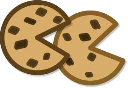

# cookie-cookie
**Cookie Cookie**! A project template for... project templates...

## Features
- Inspired by [cookiecutter-template](https://github.com/eviweb/cookiecutter-template)
- See [cookiecutter-git](https://github.com/webevllc/cookiecutter-git#features) Features

## Requirements
- [git](https://git-scm.com/downloads)
- [python](https://www.python.org/downloads/)
- [cookiecutter](https://github.com/audreyr/cookiecutter)

## Usage
    $ cookiecutter gh:webevllc/cookie-cookie
    # OR
    $ cookiecutter https://github.com/webevllc/cookie-cookie

### Example
See [cookie-cookie-example](https://github.com/webevllc/cookie-cookie-example)

## Development
See [CONTRIBUTING](CONTRIBUTING.md)

## History
See [CHANGELOG](CHANGELOG.md)

## Credits
See [AUTHORS](AUTHORS.md)

## License
See [LICENSE](LICENSE), [NOTICE](NOTICE)
